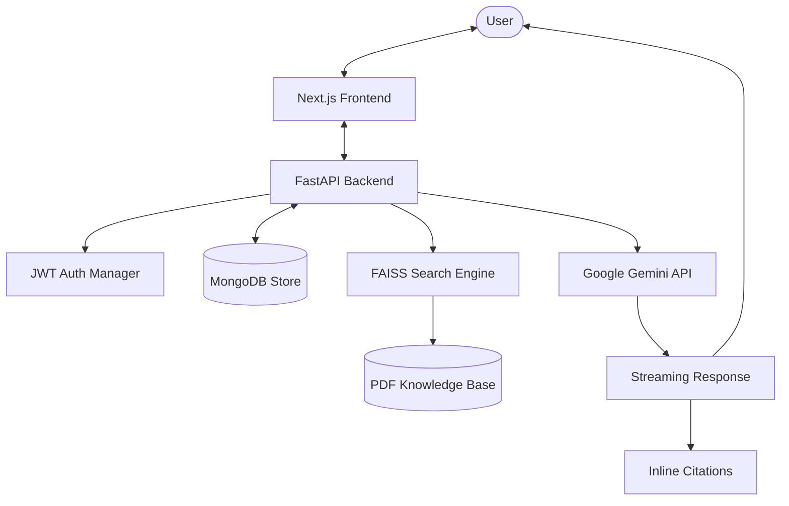
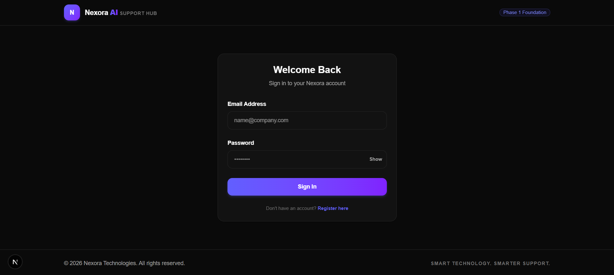
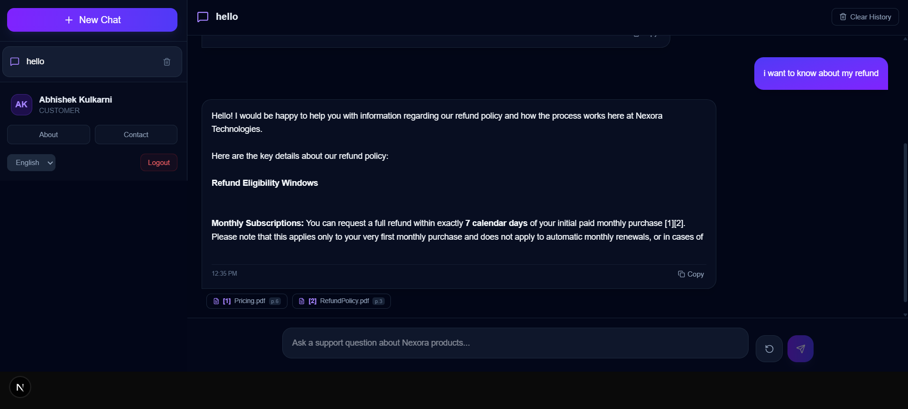

# Nexora AI Support Hub

[](LICENSE)
[](https://fastapi.tiangolo.com)
[](https://nextjs.org)
[](https://www.mongodb.com)
[](https://deepmind.google/technologies/gemini/)
[](https://github.com/facebookresearch/faiss)

Nexora AI Support Hub is a production-grade, enterprise customer support platform powered by Retrieval-Augmented Generation (RAG). It enables customers and support representatives to obtain highly accurate, grounded answers to inquiries by semantic search over official company product guides, warranties, and policy documentation.

---

## 📖 Project Overview

Customer support systems frequently struggle with response accuracy, either delivering generic auto-replies or hallucinating critical details about warranties, shipping, or policies. Nexora AI Support Hub addresses this by leveraging a local semantic vector database to supply exact, relevant source passages as context to the Google Gemini model. 

### Why Retrieval-Augmented Generation (RAG)?
* **Grounded Responses**: The system restricts model responses to the facts present in the retrieved context blocks, eliminating generic hallucinations.
* **Inline Citations**: Every claim is mapped back to its source PDF file name and page number, enabling immediate human verification.
* **Secure and Stateful**: Incorporates full session management, conversation logging, and role-based permissions in MongoDB to support authentic multi-turn chat tracking.

---

## 🚀 Key Features

* **🔐 Secure JWT Authentication**: Robust registration and login sessions using JWT tokens stored securely.
* **🛡️ Role-Based Access Control (RBAC)**: Fine-grained permissions separating `customer`, `support_rep`, and `admin` roles.
* **📂 MongoDB Conversation Storage**: Chronological conversation history and messages normalized in decoupled database collections.
* **🧠 Multi-turn Memory**: History lookup tracks up to 10 context frames to enable seamless pronoun resolution.
* **⚡ FAISS Vector Search**: Multilingual vector indexes query relevant chunks using SentenceTransformers embeddings.
* **🤖 Google Gemini Integration**: Integrated official `google-genai` SDK executing streaming inference.
* **🌊 Streaming AI Responses**: Immediate token delivery over EventSource Server-Sent Events (SSE).
* **📌 Source Citations**: Interactive source badges indicating match scores, page ranges, and document titles.
* **💡 Contextual Follow-ups**: Dynamic suggestions parsed from context blocks presented as clickable options.
* **🏢 Company Information Panel**: Quick-access drawer showing operating hours, helpline numbers, and emails.
* **🌐 Multilingual Support**: Standardized translation alignments across English, Hindi, and Marathi.
* **📱 Responsive & Accessible UI**: WCAG-compliant design with focus outlines, keyboard shortcuts (`Enter`/`Space` events), and mobile-responsive layouts.
* **🛡️ Production Error Handling**: Custom exception shields hiding traceback stacks, replacing connection/rate-limit issues with friendly user suggestions (e.g., retry delays).

---

## 📐 System Architecture

The following flow represents the grounded RAG query lifecycle:



---

## 🛠️ Tech Stack

* **Frontend**: Next.js 16 (App Router), React 19, TypeScript, Axios client, Tailwind CSS, Lucide icons
* **Backend**: FastAPI (Python 3.12), Uvicorn, Pydantic v2 (Settings validation)
* **Database**: MongoDB (via asynchronous Motor driver)
* **Authentication**: JWT (JSON Web Tokens), cookies, bcrypt password hashing
* **AI Engine**: Google GenAI SDK (`google-genai`), Gemini API
* **Vector Search**: FAISS (Facebook AI Similarity Search), SentenceTransformers (`paraphrase-multilingual-MiniLM-L12-v2`)
* **Testing**: Pytest, Pytest-Asyncio, HTTPX

---

## 📁 Folder Structure

```text
Nexora-AI-Support-Hub/
├── backend/
│   ├── api/
│   │   └── v1/
│   │       ├── chat.py           # Chat & streaming endpoints
│   │       └── endpoints.py      # Auth, Profile, and Admin routes
│   ├── core/
│   │   ├── config.py             # Settings configurations
│   │   ├── security.py           # Cryptography & token validations
│   │   └── middleware.py         # Request headers & CORS
│   ├── database/
│   │   └── connection.py         # Async Motor MongoDB connection manager
│   ├── rag/
│   │   └── indexing.py           # FAISS search indexing routines
│   ├── schemas/
│   │   ├── auth.py
│   │   ├── chat.py
│   │   └── user.py
│   ├── services/
│   │   ├── auth_service.py       # Hashing and authentication
│   │   ├── chat_service.py       # RAG context parsing & Gemini streams
│   │   └── rag_service.py        # Sentence embeddings and FAISS search
│   ├── tests/                    # Pytest backend test suite
│   ├── main.py                   # FastAPI main entrypoint
│   └── requirements.txt          # Production backend dependencies
├── frontend/
│   ├── app/
│   │   ├── (protected)/          # Auth protected routes
│   │   │   ├── chat/             # Grounded chat engine interface
│   │   │   ├── dashboard/
│   │   │   └── profile/
│   │   ├── login/
│   │   ├── register/
│   │   └── page.tsx              # Portal welcome gate
│   ├── components/
│   │   ├── auth/
│   │   │   └── AuthProvider.tsx  # Global Auth Context Manager
│   │   └── chat/
│   │       ├── ChatSidebar.tsx   # History list and profile settings footer
│   │       └── MessageBubble.tsx # Bubble wrapper, citations, suggestions
│   ├── lib/
│   │   └── api-client.ts         # Axios client
│   ├── services/
│   │   ├── auth.ts
│   │   ├── chat.ts               # SSE stream reader and API endpoints
│   │   └── health.ts
│   └── package.json
├── knowledge_base/               # Knowledge base PDFs
├── vectorstore/                  # FAISS index
├── LICENSE
├── .env.example
└── README.md
```

---

## 💻 Installation & Setup

### Prerequisites
* **Node.js**: `v22.x` or later
* **npm**: `v10.x` or later
* **Python**: `v3.12.x`

### 1. Copy Environment Settings
Clone the repository, copy the root environment file and customize variables:
```powershell
# Copy global example template
copy .env.example .env

# Distribute configuration to frontend and backend modules
copy .env frontend/.env
copy .env backend/.env
```

### 2. Backend Setup
1. Activate the Python virtual environment:
   ```powershell
   .venv\Scripts\Activate.ps1
   ```
2. Install dependencies:
   ```powershell
   python -m pip install -r backend/requirements.txt
   ```
3. Boot the FastAPI web server:
   ```powershell
   python -m uvicorn backend.main:app --reload --host 127.0.0.1 --port 8000
   ```

### 3. Frontend Setup
1. Navigate to the frontend directory:
   ```powershell
   cd frontend
   ```
2. Install package dependencies:
   ```powershell
   npm install
   ```
3. Run the Next.js development client:
   ```powershell
   npm run dev
   ```
   Open [http://localhost:3000](http://localhost:3000) in your web browser.

---

## ⚙️ Environment Variables

The application is driven entirely by environment variables. Ensure the following configurations are set inside your `.env` files:

| Variable | Description | Example / Default |
| :--- | :--- | :--- |
| `GEMINI_API_KEY` | Google Developer Gemini API Key | `AIzaSy...` |
| `GEMINI_MODEL` | Google Gemini Target Model | `gemini-2.5-flash` |
| `JWT_SECRET_KEY` | Secret Key used to sign JWT Tokens | *32-Character Random String* |
| `MONGODB_URI` | Async MongoDB Server Connection URI | `mongodb://localhost:27017` |
| `MONGODB_DATABASE` | Target Database Name in MongoDB | `nexora_support_db` |
| `FRONTEND_URL` | Trusted Client Origin (CORS validation) | `http://localhost:3000` |

---

## 📈 Performance Highlights

* **SSE Streaming**: Token streaming starts instantly, achieving a Time-To-First-Token (TTFT) of under 1 second.
* **MongoDB Indexing**: Compound indexes on (`user_id` + `updated_at`) and (`conversation_id` + `timestamp`) optimize message retrieval.
* **FAISS Search**: FAISS indexes fetch top context blocks in less than 50ms.
* **Memory Optimization**: Limits history lookup and context chunks to stay within a maximum prompt budget.

---

## 🔒 Security Specifications

* **JWT Sessions**: Session tokens are verified on every API request.
* **Authorization MIDDLEWARE**: Endpoints validate ownership so users can only access their own conversations.
* **Password Security**: Password inputs are hashed using bcrypt before database persistence.
* **Sanitized Logs**: Backend timing logs exclude conversational contents, personal identifiers, and keys.

---

## 🧪 Testing & Code Quality

The system is tested end-to-end:

### Backend Testing (Pytest)
Execute the pytests suite:
```powershell
.venv\Scripts\pytest
```
* **Status**: **47/47 passing tests**
* **Items Covered**: User registers, JWT expirations, chat ownership limits, injection overrides, retry policies, and timeout fallbacks.

### Frontend Validation (Linting & Compilation)
Verify Next.js and TypeScript compiles:
```powershell
cd frontend
npm run lint
npm run build
```
* **ESLint Status**: **0 errors, 0 warnings**
* **Next.js Builder**: Production builds compile cleanly with optimized routes.

---

## 📸 Interface Screenshots

* **Authentication Gate**: `[/docs/screenshots/auth_login.png]` - Secure login panel.
* **RAG Workspace**: `[/docs/screenshots/rag_workspace.png]` - Grounded multi-turn conversational chat.
* **Citations Detail**: `[/docs/screenshots/citations_popover.png]` - Popover tooltips displaying match scores and page indices.
* **Company Information Drawer**: `[/docs/screenshots/company_drawer.png]` - Sliding drawer displaying mock contacts and office details.
* **Responsive Mobile Interface**: `[/docs/screenshots/mobile_responsive.png]` - Fluid mobile UI layout with header navigation.

---

## 🔮 Future Enhancements

* **🎙️ Voice Support**: Integration of WebRTC/audio streams for voice-based inquiries.
* **🎫 Ticket Escalation**: Automatic generation of support tickets in Zendesk/Jira if the AI fallback is triggered.
* **📊 Analytics Dashboard**: Admin dashboard monitoring token usage, common queries, and match metrics.
* **🔄 Live Handoff**: Smooth transition routing to human support representatives.

---

## Login



## Chat Interface



---

## 📄 License

Distributed under the MIT License. See [LICENSE](LICENSE) for more information.

---

## 👤 Author

* **Developed by**: Abhishek Kulkarni
* **GitHub Profile**: [@Abhishek5472](https://github.com/Abhishek5472)

---

## 🤝 Acknowledgements

* [FastAPI](https://fastapi.tiangolo.com/)
* [Next.js App Router](https://nextjs.org/)
* [MongoDB Atlas](https://www.mongodb.com/cloud/atlas)
* [Google Gemini API](https://ai.google.dev/)
* [FAISS Facebook Research](https://github.com/facebookresearch/faiss)
* [Tailwind CSS](https://tailwindcss.com/)
* [React Markdown](https://github.com/remarkjs/react-markdown)
